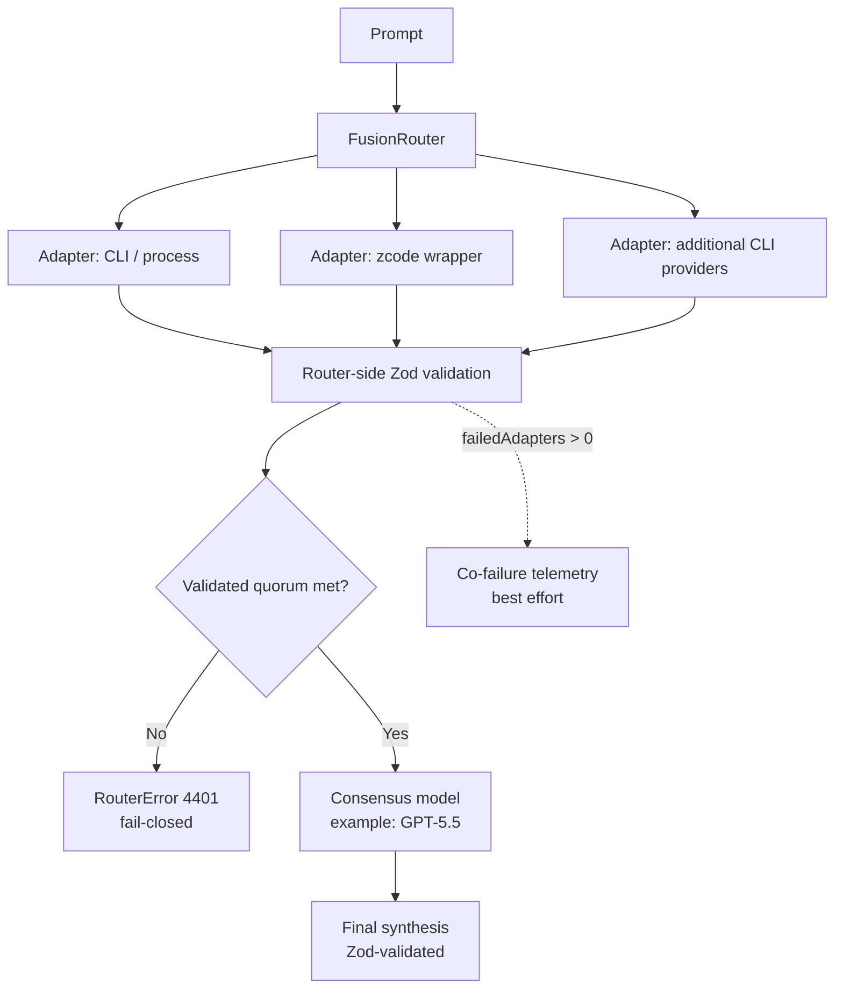

# fusion-router

[](https://github.com/sakamoto-sann/fusion-router/releases)
[](https://deno.com/)
[](#status)
[](#fail-closed-contract)

A small, readable proof-of-concept for a **fusion router** that fans out a prompt to multiple **CLI / wrapper-backed LLM adapters**, validates their outputs with **Zod**, and asks a stronger model (here **Codex / GPT-5.5**) to produce the final consensus.

## Status

> **PoC, but no longer mock-only.** This repository now ships real process-backed adapters for Codex CLI, Claude Code, Gemini CLI, Grok CLI, Devin CLI, Cline, and a repo-local `bin/zcode-headless` wrapper lane for GLM.
> Live success still depends on each host having the right CLI installed and authenticated.

## Architecture at a glance

> Conceptual diagram for the current **process-backed PoC**. The repository favors local CLIs / wrappers over direct provider SDK calls.



## What this PoC demonstrates

- Parallel fan-out across multiple CLI / wrapper adapters
- Zod validation at both the **adapter output** layer and the **final consensus** layer
- **Fail-closed** routing boundaries
  - invalid adapter outputs are rejected
  - insufficient validated responses abort consensus
  - invalid synthesis output aborts the request with a structured error
- real process-backed adapter execution through installed CLIs / wrappers
- auth/session readiness checks plus optional refresh hooks per adapter
- retry policy with backoff for transient failures / rate limiting
- estimated spend budget guardrails per lane
- per-adapter circuit breaking after repeated failures
- bounded adapter execution, even if an adapter ignores `AbortSignal`
- **Co-failure telemetry** capture with an OTLP/HTTP log sink option
- Support for describing multiple adapter surfaces:
  - CLI/process-backed adapters
  - OAuth-backed wrapper lanes where a provider-specific bridge actually makes sense
  - session-backed tool surfaces such as Codex CLI, Claude Code, Devin, and Cline

## Included surfaces in the PoC

The default router wires real process-backed adapters for these surfaces:

| Surface | Example auth | Example transport | Current command |
|---|---|---|---|
| OpenAI (Codex CLI) | session-backed | `processAdapter` | `codex exec` |
| Anthropic (Claude Code) | session-backed | `processAdapter` | `claude -p` |
| Google (Gemini CLI) | API key | `processAdapter` | `gemini -p` |
| GLM | OAuth | `zcodeWrapper` | `bin/zcode-headless --mode plan --prompt ...` |
| xAI (Grok CLI) | session-backed | `processAdapter` | `grok -p` |
| Cognition (Devin) | session-backed | `processAdapter` | `devin -p` |
| Cline | session-backed | `processAdapter` | `cline --json` |

`authMode` and `transport` are not just table labels anymore: the router now maps readiness checks, optional refresh hooks, wrapper-specific env/token plumbing, retries, estimated budget guardrails, and circuit-breaking behavior into each process-backed adapter. The GLM lane stays isolated behind `zcodeWrapper` via `bin/zcode-headless`; everything else is modeled as a CLI/process surface instead of pretending to be a direct API.

## Fail-closed contract

This PoC does **not** silently continue into a fake consensus when the validated quorum is missing.

If the router cannot gather enough validated adapter outputs, it throws a structured `RouterError` with status `4401`.

Telemetry is still **best effort** on the request path: sink failures are logged, but they do not block the main request. The shipped code includes an OTLP/HTTP log sink so correlated failures can be forwarded to OpenTelemetry-compatible backends.

## Local run

This repo uses remote Deno imports plus local CLI execution, so run it with:

```bash
deno run --allow-run --allow-read --allow-write --allow-env --allow-net router.ts
```

## Next production steps

1. Install / authenticate the required CLIs on each target host (Claude Code, Gemini CLI, Cline, and `zcode` may still fail if the local session is missing or invalid)
2. Supply a valid ZCode model config (for example `~/.zcode/cli/config.json`) on hosts that should execute the GLM lane
3. Persist budget / circuit-breaker state outside process memory
4. Add CI smoke jobs that exercise each installed CLI lane separately
5. Add vendor-specific OTLP/Honeycomb/Datadog deployment examples and dashboards
